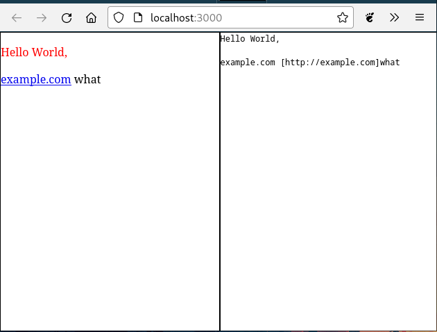

# Svelte Mail Development

Uses a live server to display the mail in the browser as well as a plain text variant of it.



installation for your use:

```bash
npx degit streamonkey/svelte-email my-email-folder

cd my-email-folder

npm install
```

to open a hot reloading server run [localhost:3000](http://localhost:3000):

```bash
npm run dev
```

then change `src/Mail.svelte`

if you just want to build the email:

```
npm run build
```

The rendered e-mails are located in `dist`